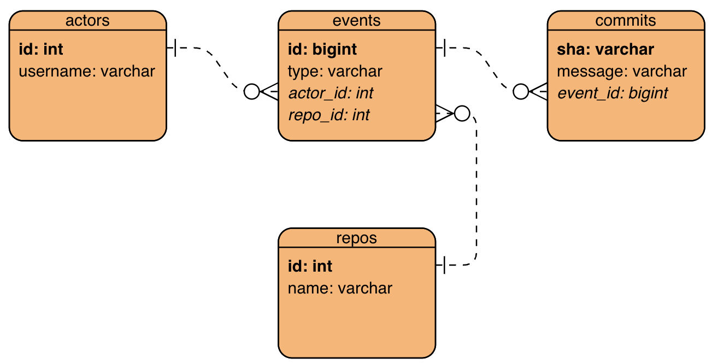
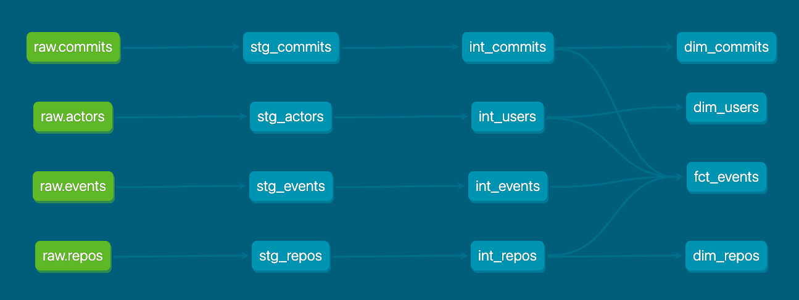

# Analytics Engineer assignment resolution

[](https://airflow.apache.org/docs/apache-airflow/2.6.3/index.html) [](https://www.python.org/downloads/release/python-31012/) <br>[](https://docs.astral.sh/ruff/) [](https://black.readthedocs.io/en/stable/) [](https://pycqa.github.io/isort/)<br>[](https://conventionalcommits.org) [](https://pre-commit.com/)

In this document, you'll find information and instructions about my solution to the analytics engineer assignment.

## Directories structure

This is the structure of the project.

```text
.
├── .dockerignore
├── .env.airflow.local.example
├── .env.dbt.local.example
├── .env.postgres.local.example
├── .gitignore
├── .pre-commit-config.yaml
├── .python-version
├── .sqlfluff
├── .sqlfluffignore
├── .vscode
│   ├── extensions.json
│   └── settings.json
├── Analytics Engineer Assessment.docx
├── Dockerfile.airflow
├── Dockerfile.dbt
├── LICENSE
├── Makefile
├── README.md
├── analytics_engineer_assessment.pdf
├── dags
│   ├── .airflowignore
│   ├── settings.py
│   └── transformations.py
├── dbt
│   ├── analyses
│   │   └── .gitkeep
│   ├── dbt_project.yml
│   ├── macros
│   │   ├── .gitkeep
│   │   ├── generate_raw_data.sql
│   │   ├── generate_schema_name.sql
│   │   └── macros.yml
│   ├── models
│   │   ├── core
│   │   │   ├── core.yml
│   │   │   ├── core_commits.sql
│   │   │   ├── core_events.sql
│   │   │   ├── core_repos.sql
│   │   │   └── core_users.sql
│   │   ├── landing.yml
│   │   ├── marts
│   │   │   ├── marts.yml
│   │   │   └── reporting
│   │   │       ├── dim_commits.sql
│   │   │       ├── dim_repos.sql
│   │   │       ├── dim_users.sql
│   │   │       ├── fct_events.sql
│   │   │       └── reporting.yml
│   │   └── staging
│   │       ├── staging.yml
│   │       ├── stg_actors.sql
│   │       ├── stg_commits.sql
│   │       ├── stg_events.sql
│   │       └── stg_repos.sql
│   ├── packages.yml
│   ├── profiles.yml
│   ├── seeds
│   │   ├── .gitkeep
│   │   ├── raw
│   │   │   ├── actors.csv
│   │   │   ├── commits.csv
│   │   │   ├── events.csv
│   │   │   └── repos.csv
│   │   └── seeds.yml
│   ├── snapshots
│   │   └── .gitkeep
│   └── tests
│       └── .gitkeep
├── docker-compose.yml
├── mypy.ini
├── noxfile.py
├── poetry.lock
├── pyproject.toml
└── scripts
    └── postgres_init.sh
```

## What you'll need

This solution is containerized, so you'll need to [install docker and docker-compose](https://docs.docker.com/get-docker/).

Also, it's recommended to have a desktop SQL client like [DBeaver](https://dbeaver.io/download/).

On a secondary stage, you can install the recommended VS Code extensions.

## Setup

Let's dive into the setup process.

### 1. Generate the environment variables

Open a shell in your machine, and navigate to this directory. Then run:

```bash
make generate-dotenv
```

This will generate three `.env` files with predefined values. Please, go ahead and open it! If you want to modify some values, just take into account that this may break some things.

### 2. Install the project dependencies

Run these commands in this sequence:

```bash
make install-poetry
make install-project
make dbt-install-pkgs
```

Optionally, if you've cloned the repo, you can run:

```bash
make install-pre-commit
```

To install the pre-commit hooks and play around with them.

### 3. Build the images

Run:

```bash
make build services="postgres bootstrap-dbt"
```

This will build all the required images.

### 4. Create the services

Run:

```bash
make up services="postgres bootstrap-dbt"
```

This will create a PostgreSQL database, and all the raw tables, and run a command that populates those tables with the provided data.

### 5. Connect to the DB locally

Open DBeaver, and set up the connection to the database. If you didn't modify the `.env` files, you can use these credentials:

- User: `clara`
- Password: `clara`
- Host: `localhost`
- Port: `5440`
- DB: `clara`

Then, please open the `queries.sql` and `view.sql` files and run queries in DBeaver to verify the results.

If you don't have DBeaver, you can run the queries from PostgreSQL's terminal with [psql](https://www.postgresql.org/docs/14/app-psql.html). To do this, please run:

```bash
make execute-sql
```

Then you can run the queries from the terminal.

## Creating the data model

In this section, we'll materialize the data model with `dbt`.

In your terminal, run:

```bash
make dbt-run-model node="--target prod"
```

And wait until all the models are finished.

## Assignment resolution

### How I've created the data model

#### 1. Understanding the raw data

First of all, I've manually inspected the provided raw data by digging into it. Then, I took a look at [the GitHub Events API docs](https://docs.github.com/en/rest/using-the-rest-api/github-event-types?apiVersion=2022-11-28).

Once I had that in mind, I understood the relations between the provided data. Here's an ERD:

<br>

The relationship highlights are:

- One actor/user can have multiple events (e.g., `event_type = 'PushEvent'` and different commit SHAs)
- One repository can have multiple events
- One commit represents one single transaction

#### 2. Analyzing deeply the raw data

Taking a closer look into the raw data, I realized that there were some duplicates in the `repos` and `users` tables, and I've found (mainly) 2 strange things in those tables.

First, there are 2 different usernames with the same id (`59176384`):

```sql
SELECT
    id
    , COUNT(DISTINCT username) AS num_of_users_per_id
FROM raw.actors
GROUP BY 1
ORDER BY 2 DESC
LIMIT 5
```

The usernames are:

| id | username |
|---|---|
| 59176384 | starnetwifi |
| 59176384 | starwifi88 |

So I decided to use `DISTINCT ON` in the pipeline as deduplication logic, so the first row remains.

Second, there are 14 repositories ID repeated with different names:

```sql
SELECT
    id
    , COUNT(DISTINCT name) AS num_of_names_per_id
FROM raw.repos
GROUP BY 1
ORDER BY 2 DESC
LIMIT 15
```

For example, the ID `230999134` has the following names:

| id | name |
|---|---|
| 230999134 | hseera/dynamodb-billing-mode |
| 230999134 | hseera/dynamodb-update-capacity |
| 230999134 | hseera/update-dynamodb-capacity |

So I took the same logic into account in the pipeline.

These decisions were taken because no further explanations were provided.

Another thing that is worth mentioning is that the `PullRequestEvent` event doesn't have [the payload data](https://docs.github.com/en/rest/using-the-rest-api/github-event-types?apiVersion=2022-11-28#event-payload-object-for-pullrequestevent), so it's impossible to distinguish the events between opened, edited, closed, etc. I've assumed that the `PullRequestEvent` corresponds to the PR `opened` event.

This is because of the nature of the first question:

> Top 10 active users sorted by the amount of PRs created and commits pushed

The real question that I'll be answering is:

> Top 10 active users sorted by the amount of PRs events and commits pushed

Please take into account that, as per the question, the commits do not necessarily have to be related to the same PR.

Finally, I understood that the phrase `active users` refers not to a bot.

#### 3. Create draft queries to answer the questions

I thought:

> I have the questions that I need to answer, so... how does a SQL query that answer them might look like?

_I'm assuming that the data consumers are familiar with SQL. If this is not the case, the solution might be to create a specific report schema and tables with the results of the following queries._

Let's think about the first one:

> Top 10 active users sorted by the amount of PRs created and commits pushed

It will look somehow like these:

```sql
SELECT
    dim_users.user_id
    , dim_users.username
    , COUNT(*) AS num_prs_created_and_commits_pushed
FROM some_schema.fct_events
LEFT JOIN some_schema.dim_users
    ON fct_events.user_id = dim_users.id
WHERE fct_events."type" IN ('PushEvent', 'PullRequestEvent')
GROUP BY 1, 2
ORDER BY 3 DESC
LIMIT 10
```

Where:

- `dim_users` is a dimension table, containing the user ID and username
- `fct_events` is the fact table, containing all the events

So at first sight, the `dim_users` can be an [SCD type 2](https://en.wikipedia.org/wiki/Slowly_changing_dimension), as the username rarely changes over time, but it can. It seemed an overkill for this specific case, so I decided to model it as a type 0.

Performing a similar thing for the rest of the questions:

> Top 10 repositories sorted by the amount of commits pushed
>
> Top 10 repositories sorted by the amount of watch events

I realized that the queries would be quite similar to the previous one, and the other dimensions were very straightforward. So, these tables were created too:

- `dim_commits` is a dimension table, containing the commit ID, the commit SHA, and the event ID
- `dim_repos` is a dimension table, containing the repo ID and name

#### 4. Create the models

I decided to use [classic modular data modeling techniques](https://www.getdbt.com/analytics-engineering/modular-data-modeling-technique#what-is-modular-data-modeling), and thought about these layers:

- `staging`: just a copy of the landing/source tables with some types casting (if needed), in order to standardize
- `intermediate`: here I'll place reusable models, with some deduplication logic
- `marts`: here I'll place the final models, in a star schema (facts surrounded by dimensions)

Since the raw data doesn't need much processing (just some deduplication logic), all of the models in the `staging` and `intermediate` layers will be quite similar, and the only difference will be the deduplication logic. I've created a macro to apply [the DRY principle](https://docs.getdbt.com/terms/dry) in these layers.

The final lineage graph is as follows:



### SQL queries for reporting

Using the data model created with `dbt`, you can answer the required questions.

Please, run these queries in DBeaver to verify the results.

```sql
-- Top 10 active users sorted by the amount of PRs created and commits pushed
SELECT
    fct_events.user_id AS user_id
    , dim_users.username AS username
    , COUNT(*) AS num_prs_created_and_commits_pushed
FROM reporting.fct_events
LEFT JOIN reporting.dim_users
    ON fct_events.user_id = dim_users.id
WHERE fct_events."type" IN ('PushEvent', 'PullRequestEvent')
    AND NOT username ~* '-bot|\[bot\]|bot$'
GROUP BY 1, 2
ORDER BY 3 DESC
LIMIT 10
```

```sql
-- Top 10 repositories sorted by the amount of commits pushed
SELECT
    fct_events.repo_id AS repo_id
    , dim_repos.name AS repo_name
    , COUNT(*) AS num_commits_per_repo
FROM reporting.fct_events
LEFT JOIN reporting.dim_repos
    ON fct_events.repo_id = dim_repos.id
WHERE fct_events.commit_sha IS NOT NULL
GROUP BY 1, 2
ORDER BY 3 DESC
LIMIT 10
```

```sql
-- Top 10 repositories sorted by the amount of watch events
SELECT
    fct_events.repo_id AS repo_id
    , dim_repos.name AS repo_name
    , COUNT(*) AS num_watch_events_per_repo
FROM reporting.fct_events
LEFT JOIN reporting.dim_repos
    ON fct_events.repo_id = dim_repos.id
WHERE fct_events."type" = 'WatchEvent'
GROUP BY 1, 2
ORDER BY 3 DESC
LIMIT 10
```

### Model contracts and tests

I've added some tests in the `intermediate` and `reporting` layers to verify the correctness of the data and ensure the data quality.

Generally speaking, the tests aim to ensure:

- No ID is missing
- Data types are as expected
- There are no duplicates
- Critical columns are present

Also, there are some model contracts enforced in the `reporting` layer, in order to avoid inserting duplicated fields, nulls, etc., and to ensure the models' relations.
